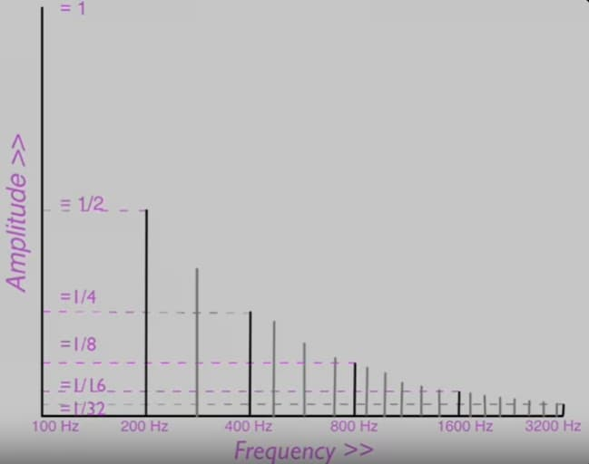

# [Introduction to Classical Music](https://www.coursera.org/learn/introclassicalmusic)

## Resources

- [The Essential Listening to Music](https://www.cengage.com/c/the-essential-listening-to-music-2e-wright)
- [Embeddable Playlist](https://open.spotify.com/embed?uri=spotify:user:gauravkumar87:playlist:6sPZCTmf5razbg3CfCXsuF)
- [List of Compositions](https://docs.google.com/document/d/19-NdzaxFVggo8JH-4Ev481zhNvt_jNR68ParXlbB5SA/)
- _[The Hidden Habits of Genius](https://craigwrightgeniusmusic.net/)_

## Week 1 Why we like and what we like

Music is about the second life, the life of imagination.

“Music is what feelings sound like.” — Victor Hugo

### Popular Music and Classical Music Compared

- Pop Music often uses electronic instruments; classical music usually uses acoustic instruments.
- Pop music often includes lyrics that describe the emotion of the music.
- Pop music often has a strong beat; classical music may be more subdued.
- Pop music is often short and repetitious.
- Pop music is often performed without musical notation; classical music is often performed with a score.

### Music and Emotions

Music is the poetry of the air. Indeed, music can move us. Music can manipulate us. Advertisers and marketing people know this. They use music to persuade us to buy something.

### How Do We Hear Music? Sound Waves and the Ear

Maybe the brain is as mysterious as music itself.

- Neurotransmitters are stimulated when listen to music.
- Neurotransmitters excite or inhibit neighboring cells; they also control the release of chemicals such as dopamine and glutamates that affect our emotional response to music.

Neuroscientists have discovered that music has the same effect as “other euphoria-inducing stimuli, such as food, sex, and drugs of abuse” (I’m not kidding). So that's interesting. Music is like candy for the mind. So don't take drugs, listen to music. It's a lot better for you.

Music does effect our brain and causes us to feel the way we do when listen to it. We have a direct physiological response to music.

### Why We Like What We Like?

How do we get the musical template (the musical expectations that we have when we come to listen to a piece of music)? Two ways: through nurture and through nature.

- It's Nurture. We like what we like because we've heard it all our lives. We are comfortable with it, it is comforting to us.
- It's Nature.
  - A couple of rules for the syntax of Western music.
    - Leading Tone: Pulls toward the Home Pitch or Tonic.
    - Large Leap: A Large leap is reversed by the following pitch.
    - Harmony: The Harmony must fit with the Melody.
    - Chord Progression: The Harmonies usually return home to tonic.
  - Principals about the physics of music that apply to all musical cultures.

[Strauss: Also Sprach Zarathustra](https://courses.lumenlearning.com/musicapp_historical/chapter/strausss-also-sprach-zarathustra/)
