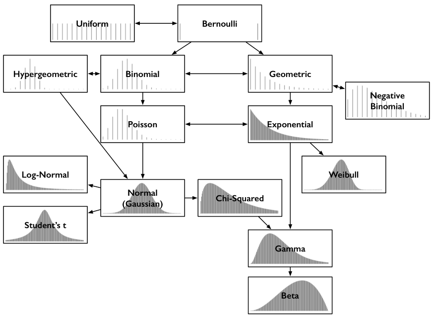

# Sampling Distributions

## Central limit theorem

With a large enough collection of samples from the same population, the sample menas will be normally distributed. with a reasonably large sample of roughly 30 or more, central limit theorem will always ring true no matter what the population looks like. It serves as the basis for all statistical experiments and empowers all of the A/B testing in practice.

## Law of large numbers

The law of large numbers states that as the size of a smaple is increased, the estimate of the sample means will more accurately reflect the population mean. It is different from the central limit theorem.
