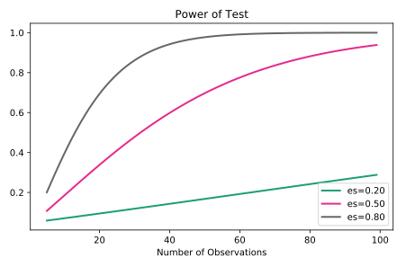

# Hypothesis Testing

- Degrees of Freedom: DF = N - P. Where N = sample size, P = the number of parameters or relationships.

## Assumptions

- Random sampling
- Independent observations
- Normally distributions
- constant variance

## Which test to use

If you know the population standard deviation and you have a sufficient sample size, you'll probably want a z-test, otherwise break out the t-test.

## Power and sample size

Power analysis involves four moving parts:

- Sample size
- Effect size
- Minimum effect
- Power

```python
sample_sizes = np.array(range(5, 100))
effect_sizes = np.array([0.2, 0.5, 0.8])

# Create results object for t-test analysis
from statsmodels.stats.power import TTestIndPower
results = TTestIndPower()

# Plot the power analysis
results.plot_power(dep_var='nobs', nobs=sample_sizes, effect_size=effect_sizes)
plt.show()
```



Not only does an increase in power result in a larger sample size, but this increase grows exponentially as the minimum effect size is increased.

## Multiple testing

- The family-wise error rate is the probability of incorrectly rejecting the true null hypothesis.
- FWER = 1-(1-alpha)^n .
- The **Bonferroni correction** controls the family-wise error rate for circumstances to avoid the high probability of Type Ⅰ error.
