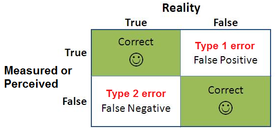

# Regression and Classification

## Regression models

### Assumptions

- Linear relationships
- Errors are mormally distributed
- Homoscedasticity
- Independent observations

### R-Squared

In statistics, the coefficient of determination, denoted R2 or r2 and pronounced "R squared", is the proportion of the variation in the dependent variable that is predictable from the independent variable(s).

### MAE vs. MSE

Minimizes squared error vsersus minimizes absolute error. Absolute error scaling linearly and squared error scaling more exponentially. Typically, if your dataset has outliers or if you're worried about individual observations, you'll want to use MSE, since squaring the errors, they are weighted more heavilly. On the other hand, if you aren't as concerned with outliers or singular observations, MAE can be used to suppress those errors a bit more.

## classification

### Techniques

- Precision = TP/(TP+FP)
- Recall = TP/(TP+FN)
- Confusion matrices. FP, known as tpye Ⅰ errors. FN, known as type Ⅱ errors.

For example, if you're building a spam detector, you probably don't want to make any type Ⅰ errors and want to optimize for precision. On the other hand, if you are trying to classify a rare disease, you normally want to avoid type Ⅱ errors, so recall is your priority.